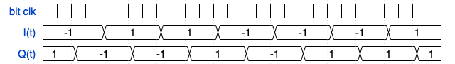

# An Opulent Voice MSK Modem for the ADALM-Pluto SDR Platform

Keywords: #MSK #SDR #Pluto #Opulent-Voice

This is a Minimum Shift Keying (MSK) modem for [Opulent Voice](https://www.openresearch.institute/2022/07/30/opulent-voice-digital-voice-and-data-protocol-update/) (OPV) targeted to Analog Devices [ADALM-Pluto](https://wiki.analog.com/university/tools/pluto/users/intro) SDR Platform. This repository provides a top-level design to be included in Pluto's [AMD Zync Z-7010 SoC](https://www.amd.com/en/products/adaptive-socs-and-fpgas/soc/zynq-7000.html). The modem and supporting functions are included from ORI's RTL library, and can be used in any FPGA development as well as non-OPV protocols. This repository can serve as a starting point/guide for targeting the MSK modem to other FPGA based SDR platforms.

The following ORI library components are used as submodules to this repository:

1. [msk_modulator](https://github.com/OpenResearchInstitute/msk_modulator)
2. [msk_demodulator](https://github.com/OpenResearchInstitute/msk_demodulator)
3. [nco](https://github.com/OpenResearchInstitute/nco)
4. [pi_controller](https://github.com/OpenResearchInstitute/pi_controller)
5. [prbs](https://github.com/OpenResearchInstitute/prbs)
6. [power_detector](https://github.com/OpenResearchInstitute/power_detector)
7. [Exponential Moving Average Filter](https://github.com/OpenResearchInstitute/lowpass_ema)

## Building Pluto Firmware
In oder to build the FPGA bitstream, you first need to install Vivado. Recommended version is 2022.2. In this documentation and in the `Makefile`, the Vivado installation path is assumed to be `/opt/Xilinx/Vivado`. If it is in another directory, change the path in the steps below (for example, to `/tools/Xilinx/Vivado`) or create a symbolic link in `/opt` pointing to the actual installation directory. For example,
```
sudo ln -s /tools/Xilinx /opt/Xilinx
```
Such a symbolic link is already in place on chococat, keroppi, mymelody, etc.
### First, clone this repo with all submodules
git clone --recursive https://github.com/OpenResearchInstitute/pluto_msk
### building bitstream only
1. cd pluto_msk/projects/pluto/
2. source /opt/Xilinx/Vivado/2022.2/settings64.sh
<br>(See above about the Vivado installation path.)
3. make

## Building Libre Firmware (bitfile builds automatically)
### First, clone this repo with all submodules
git clone --branch encoder-dev https://github.com/OpenResearchInstitute/pluto_msk.git

cd pluto_msk

git submodule update --init --recursive

cd firmware/ori/libre && ./setup_libre.sh

cd ../..

make PLATFORM=libre

For reference, on the chococat VM, the main branch for Pluto takes:
```
real	128m34.908s
user	20m41.893s
sys	11m9.086s
```
If you update the VHDL code or choose another branch and rebuild on chococat VM, the new branch takes:
```
Cleaning msk_top library ...
Building msk_top library [/home/abraxas3d/documentation-friday3/pluto_msk/library/msk_top_ip.log] ... OK
Building pluto project [/home/abraxas3d/documentation-friday3/pluto_msk/projects/pluto/pluto_vivado.log] ... OK

real	54m40.380s
user	13m58.697s
sys	5m10.603s
```
Same process on I7_9700 (not vm)
```
Cleaning msk_top library ...
Building msk_top library [/home/hp-z2-dev/prog/ori-opulent/plutosdr-fw/pluto_msk/library/msk_top_ip.log] ... OK
Building pluto project [/home/hp-z2-dev/prog/ori-opulent/plutosdr-fw/pluto_msk/projects/pluto/pluto_vivado.log] ... OK

real	6m6,197s
user	5m58,976s
sys	0m17,079s
```

If you update the firmware and rebuild on chococat VM, the new build takes:
```
real	111m34.245s
user	12m18.919s
sys	9m16.466s
```

### complete firmware
1. Check if your Vivado path is correct on this line https://github.com/OpenResearchInstitute/pluto_msk/blob/871bd130de0e6d462138bc6d2981b1c65897a0ca/firmware/Makefile#L19 
<br>See above about the Vivado installation path. If `/opt/Xilinx` does not contain the Vivado software, create the symbolic link described above. An alternative is to edit this line of `Makefile` every time you clone this repository.
2. cd pluto_msk/firmware
3. make

For reference, on the chococat VM, this takes:
```
real	370m53.093s
user	77m38.923s
sys	39m46.236s
```
## Pluto_MSK_Modem address map

- Absolute Address: 0x0
- Base Offset: 0x0
- Size: 0x43C00090

|  Offset  |  Identifier  |        Name       |
|----------|--------------|-------------------|
|0x43C00000|pluto_msk_regs|Pluto MSK Registers|

## pluto_msk_regs address map

- Absolute Address: 0x43C00000
- Base Offset: 0x43C00000
- Size: 0x90

<p>MSK Modem Configuration and Status Registers</p>

|Offset|    Identifier    |                             Name                            |
|------|------------------|-------------------------------------------------------------|
| 0x00 |    Hash_ID_Low   |            Pluto MSK FPGA Hash ID - Lower 32-bits           |
| 0x04 |   Hash_ID_High   |            Pluto MSK FPGA Hash ID - Upper 32-bits           |
| 0x08 |     MSK_Init     |                     MSK Modem Control 0                     |
| 0x0C |    MSK_Control   |                     MSK Modem Control 1                     |
| 0x10 |    MSK_Status    |                      MSK Modem Status 0                     |
| 0x14 |   Tx_Bit_Count   |                      MSK Modem Status 1                     |
| 0x18 |  Tx_Enable_Count |                      MSK Modem Status 2                     |
| 0x1C |    Fb_FreqWord   |              Bitrate NCO Frequency Control Word             |
| 0x20 |  TX_F1_FreqWord  |               Tx F1 NCO Frequency Control Word              |
| 0x24 |  TX_F2_FreqWord  |               Tx F2 NCO Frequency Control Word              |
| 0x28 |  RX_F1_FreqWord  |               Rx F1 NCO Frequency Control Word              |
| 0x2C |  RX_F2_FreqWord  |               Rx F2 NCO Frequency Control Word              |
| 0x30 |   LPF_Config_0   |PI Controller Configuration and Low-pass Filter Configuration|
| 0x34 |   LPF_Config_1   |     PI Controller Configuration Configuration Register 1    |
| 0x38 |   Tx_Data_Width  |                  Modem Tx Input Data Width                  |
| 0x3C |   Rx_Data_Width  |                  Modem Rx Output Data Width                 |
| 0x40 |   PRBS_Control   |                        PRBS Control 0                       |
| 0x44 |PRBS_Initial_State|                        PRBS Control 1                       |
| 0x48 |  PRBS_Polynomial |                        PRBS Control 2                       |
| 0x4C |  PRBS_Error_Mask |                        PRBS Control 3                       |
| 0x50 |  PRBS_Bit_Count  |                        PRBS Status 0                        |
| 0x54 | PRBS_Error_Count |                        PRBS Status 1                        |
| 0x58 |   LPF_Accum_F1   |                 F1 PI Controller Accumulator                |
| 0x5C |   LPF_Accum_F2   |                 F2 PI Controller Accumulator                |
| 0x60 |  axis_xfer_count |                      MSK Modem Status 3                     |
| 0x64 | Rx_Sample_Discard|                      Rx Sample Discard                      |
| 0x68 |   LPF_Config_2   |     PI Controller Configuration Configuration Register 2    |
| 0x6C |   f1_nco_adjust  |                   F1 NCO Frequency Adjust                   |
| 0x70 |   f2_nco_adjust  |                   F2 NCO Frequency Adjust                   |
| 0x74 |     f1_error     |                        F1 Error Value                       |
| 0x78 |     f2_error     |                        F2 Error Value                       |
| 0x7C |   Tx_Sync_Ctrl   |                   Transmitter Sync Control                  |
| 0x80 |    Tx_Sync_Cnt   |                  Transmitter Sync Duration                  |
| 0x84 |lowpass_ema_alpha1|               Exponential Moving Average Alpha              |
| 0x88 |lowpass_ema_alpha2|               Exponential Moving Average Alpha              |
| 0x8C |     rx_power     |                        Receive Power                        |


See [MSK Top Regs](rdl/msk_top_regs.pdf) for detailed register definitions.


## Development Quickstart

Here is a set of instructions for getting this minimum shift keying (MSK) transceiver implementation to work on a PLUTO SDR. 

Clone this pluto_msk repository.

```
git clone --recursive https://github.com/OpenResearchInstitute/pluto_msk.git
```

The repository should clone to the latest stable PLUTO firmware release commit. Here is an example of how to change to another branch of the hdl reference design. hdl_2022_r2 was used for VHDL development. Don't change branches of hdl unless you have to.

```
/pluto_msk/hdl$ git checkout hdl_2022_r2 
Previous HEAD position was 1978df298 axi_dac_interpolate: Improve the ctrl logic
branch 'hdl_2022_r2' set up to track 'origin/hdl_2022_r2'.
Switched to a new branch 'hdl_2022_r2'
```

If you are working on ORI virtual machine, then source the version of Vivado needed as follows. 

```$ source /tools/Xilinx/Vivado/2022.2/settings.sh```

You can check which version of Vivado is currently being used as follows. 

```
$ which vivado
/tools/Xilinx/Vivado/2022.2/bin/vivado
```
Change directories to the PLUTO project directory and run make. 

```
/hdl/projects/pluto$ make
```
A useful log file for information, warnings, and errors is pluto_vivado.log

This repository is organized as an out of tree module.

Key lines in system_bd.tcl are:

https://github.com/OpenResearchInstitute/pluto_msk/blob/942aa516f8cc30af73a5a0c9ce3f8266012989e8/projects/pluto/system_bd.tcl#L7-19

```
set_property ip_repo_paths [list $ad_hdl_dir/library ../../library]  [current_fileset]
update_ip_catalog
```
The ip_repo_paths property lets us create a custom IP catalog for use with Vivado. It defines the path to one or more directories containing user-defined intellectual property (IP), like our blocks. The specified directories, and any sub-directories, are searched for files to add to the Vivado IP catalog. The property is assigned to the current fileset of the current project. 

ip_repo_paths will look for a <component>.xml file, where <component> is the name of the IP to add to the catalog. This XML file lists the files that define the module. Subdirectories are searched through. We don't have to list out each individual module's <component>.xml.

Where does our component.xml file come from? It's create by the msk_top_ip.tcl file. A version can be found here:
https://github.com/OpenResearchInstitute/pluto_msk/blob/main/library/msk_top_ip.tcl

Setting the ip_repo_paths property needs to be followed by update_ip_catalog. 

Example syntax:

```
set_property IP_REPO_PATHS {c:/Data/Designs C:/myIP} [current_fileset]
update_ip_catalog
```

## Theory of Operation

### Modulated Waveform

Minimum-Shift-Keying (MSK) can be described as a combination of Frequency-Shift-Keying (FSK) and Offset-QPSK (OQPSK) modulations. FSK generally sends 1-bit per symbol as either a _mark_ or _space_ (represented by two frequencies $F_1$ and $F_2$, respectively) for each bit transmitted.

MSK transmits 2-bits per symbol, as does does OQPSK, and the bits are offset in time by one bit period, also the same as OQPSK. While MSK uses two frequencies like FSK, the phase of the two frequecies is modulated similarly to OQPSK, such that there are 4 distinct phase combinations for each symbol. 

The main difference between MSK and OQPSK is that MSK is a continuous phase modulation (CPM) meaning there are no phase discontinuties in the time domain waveform. This differs from QQPSK. Since MSK has no phase discontinuties, it is more spectrally efficient than FSK and most other 2-ary modulations.

MSK modulation can be expressed mathmatically in several ways, but the most interesting and intuitive form is:

$s(t) = I(t)cos\Big(\frac{2\pi F_b t}{4}\Big)cos(2\pi F_c t) + Q(t)sin\Big(\frac{2\pi F_b t}{4}\Big)sin(2\pi F_c t)$

where I(t) and Q(t) are elements of the set {-1,1}, and are offset by one bit period.



In this expression we can see that I and Q samples are each modulating two sinusoids. The $cos(2\pi F_c t)$ and $sin(2\pi F_c t)$ sinusoids are the carrier-frequency (for the pluto_msk this an IF). The more interesting sinusoids are the $cos\Big(\frac{2\pi F_b t}{4}\Big)$ and $sin\Big(\frac{2\pi F_b t}{4}\Big)$ which represent a sinusoid at $\frac{1}{4}$ the bit-rate. The I(t) and Q(t) signals each multiply $\frac{1}{2}$ of their respective sinusoid period by 1 or -1, resulting in 180 degree phase modulated sinusoids as shown below.


## Roadmap


## Contributors

## ADI add custom IP

https://wiki.analog.com/resources/fpga/docs/hdl/creating_new_ip_guide


## ASCII Text

Generated using Figlet - online version [ASCIIArt text generator](https://budavariam.github.io/asciiart-text/multi)
Font: JS Stick Letters
Font: TBD

